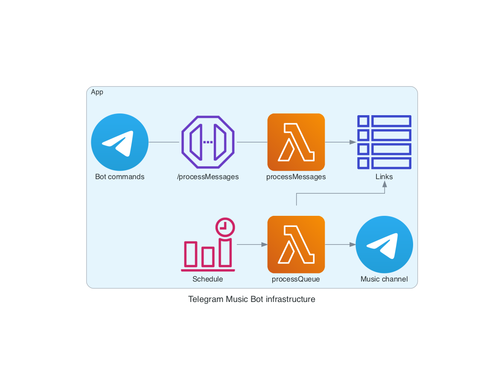

#  Telegram Music Bot

Telegram Music Bot made with Serverless framework and Node.js in AWS.

Bot can be used to add music links to a queue, which then be periodically sent to Telegram channel.

Initial boilerplate generated with serverless framework by running `npx serverless create -t aws-nodejs-typescript`.

## Infrastructure



Architecture diagram is created with [diagrams](https://pypi.org/project/diagrams/) python library. To update diagrams, install dependencies (`graphviz`required to be installed in system globally) and run the python script:

```bash
python3 -m pip install -r docs/requirements.txt
(cd docs && python3 infra.py)
```

## Telegram configuration

### Channel

For the bot you need a channel to send scheduled messages to. Create a channel and grab its id.

### Bot

1. You need to create a bot. More info [here](https://core.telegram.org/bots#3-how-do-i-create-a-bot).

	send a POST request to `https://api.telegram.org/bot<YOUR_BOT_TOKEN>/setWebhook` with body:

	```json
	{
		"url": "<YOUR_LAMBDA_ENDPOINT>"
	}
	```

	More info about setWebook [here](https://core.telegram.org/bots/api#setwebhook).

2. Add bot to a channel as admin so it can send messages there.
3. Optionally you can use BotFather's commands to make your bot more appealing with added description, about text, user pic and commands.

Currently bot supports `/start`, `/about` and `/q` commands. Bot is only handling private messages, everything else gets ignored (see `src/functions/processMessages/handler.ts`).

## AWS Systems Manager - Parameter Store configuration

You need following parameters to be stored in the same region as the application. Note that these should be set before the deployment and if you need to update them, redeployment is required:

- `telegram-music-bot-token`, as a secure string
- `telegram-music-channel-id`, as a string
- `telegram-music-cron-schedule`, as a string e.g. `0 7 ? * MON-FRI *`
- `telegram-music-bot-sentry-dsn`, as a secure string (optional)

## Install locally

- `npm ci`

## Deploy

- `aws-vault exec <PROFILE> -- npm run deploy`

## Testing

In order to test the given function locally, run the following command:

- `aws-vault exec <PROFILE> -- npx serverless invoke local -f <FUNCTION_NAME> --path src/functions/<FUNCTION_NAME>/mock.json`

## Error handling / logging

Exceptions are sent to [Sentry](https://sentry.io/) on top of them being stored in CloudWatch Logs.

## Project structure

- `functions` - containing code base and configuration for your lambda functions
- `libs` - containing shared code base between your lambdas
